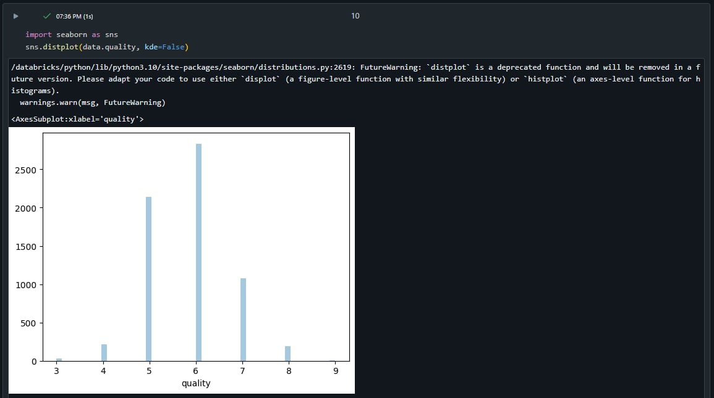

* Deploy infrastructure with terraform
```
terraform init
terraform plan -out terraform.plan
terraform apply terraform.plan
....
terraform destroy
```
* Copy notebook and data into Databricks cluster
* Execute all the steps from "ML End-to-End Example" notebook

**Databricks:**:


Importing notebook "ML End-to-End Example.dbc":


Creating compute cluster:


**Results:**

Screenshots from notebook:




